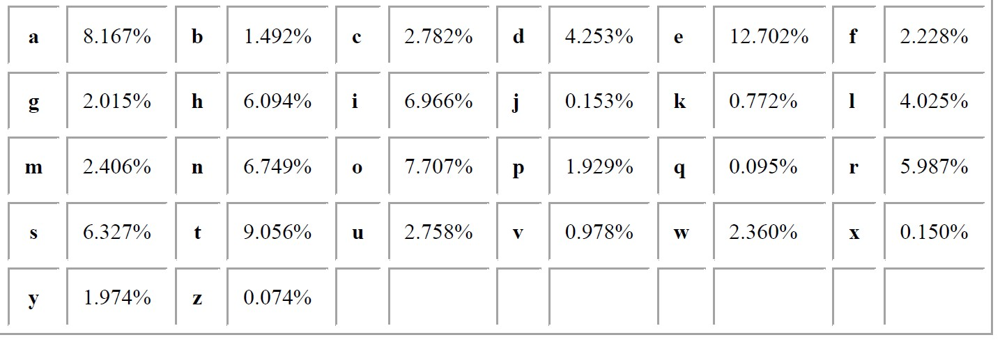
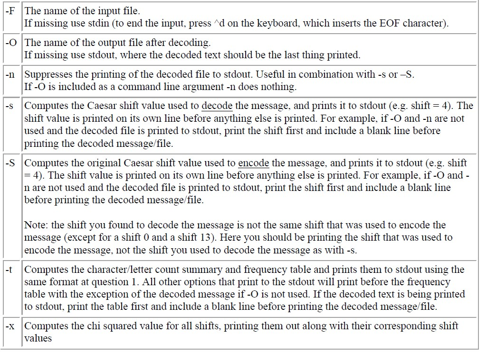

# Purpose

This Automated Ceaser Cipher is developed in C and Encoding/Decoding with Ceaser Cipher has always been something I wanted to do because it's amazing how it works. I also wanted to show others a C language implementation of this as there aren't that
many around to this extent. If you are not familiar with the Ceaser Cipher please check out this link before reading more. 

# Functionalities and Usage

## Different Files

### frequency_table.c

The files takes in text that is either encoded or not, from user input ( stdin ) or a filename provided with `-F flag`
as `shown below in the images` and outputs to command line ( stdout ) and prints the frequency table which is a table of
various character counts.

The frequencies are determined by the following common frequencies :

- Total number of letters in the text
- Total number of characters in the text

### decode.c

This file computes frequencies with the first file, then uses a  for a given shift "guess". This examines all possible shifts ( 0 - 25) and determines a shift which
should decode the message.

## copyrecords.c

This file will copy records to a new file ( in binary format ), assuming ; we have a file of records in binary mode `which is already provided`. They are copied decoded, but these operations are varied provided the use of the flags.

## Flags

Below are the first subset of flags that may be used with their details.

- `Only -F is to be used for 'frequency_table.c'.`
- `Any of these flags can be implemented in 'decode.c'.`
- Any flags other than -F and -O may be used conjunctively

`Example : ./decode –stx –F myfile.txt –O decodedfile.txt`

Below is the second subset of flags that may be used for `copyrecords.c` specifically
for the binary operations file.

# Compilation

Compilation is done through the makefile provided, with the following operations
`make clean`
`make all`
`./frequecy_table <flags> `
`./decode <flags>`
`./copyrecords <flags>`

# File structure

Everything is provided go ahead and try this program. For easiest use drag the test files to the src folder
so that they are easily acessible.
`/Src : Has all the source code, headers and makefiles`
`/Demo: In depth look at the flags`
`/test: Has all the test files`

records file is to be used for input in `copyrecords.c`
text files input ( with encoded message ) are to be used in any of the files

# Constraints

- Character count includes special characters `\n, \0`
- Maximum length of a word 45 characters
- File name maimum length of 20 characters
- Anything that is not a letter is untouched in the encoding/decoding sequences
- Records from inputfile are in order
